[5 Bucket Money Management](https://mariamar95.github.io/jan-hackathon/)

During our brainstorm meeting, we analyzed the strengths of the team and we discovered that we are stronger at front-end development. Which led us to the decision to focus primarily on a frontend based project to make sure that everyone from the team is included and can contribute to the project.
As a team, we discussed few different ideas for this project and we all decided that we would like to take the 5 Bucket Money Management Concept and turn it into real life and fully usable project.

The Savvy Savers Application, based on Dan Lok's [5 Bucket Money Management Concept](https://medium.datadriveninvestor.com/how-to-manage-money-5b490e9d3d63), is a finance calculator that displays a breakdown of annual spending.

Dan Lok's concept was designed to teach the user the habit of managing money as a long term solution. This is done by breaking our salaries into 5 different buckets; Expenses, Emergency, Investment, Learning and Fun. The suggestion is to commit 60% of our salary to the Expenses bucket and 10% in each of the others. However, these percentages can be adjusted to suit bigger and smaller salaries.

Users need to enter their income, select their percentage ratio and the finance calculator displays the amount of money to put in to each bucket.

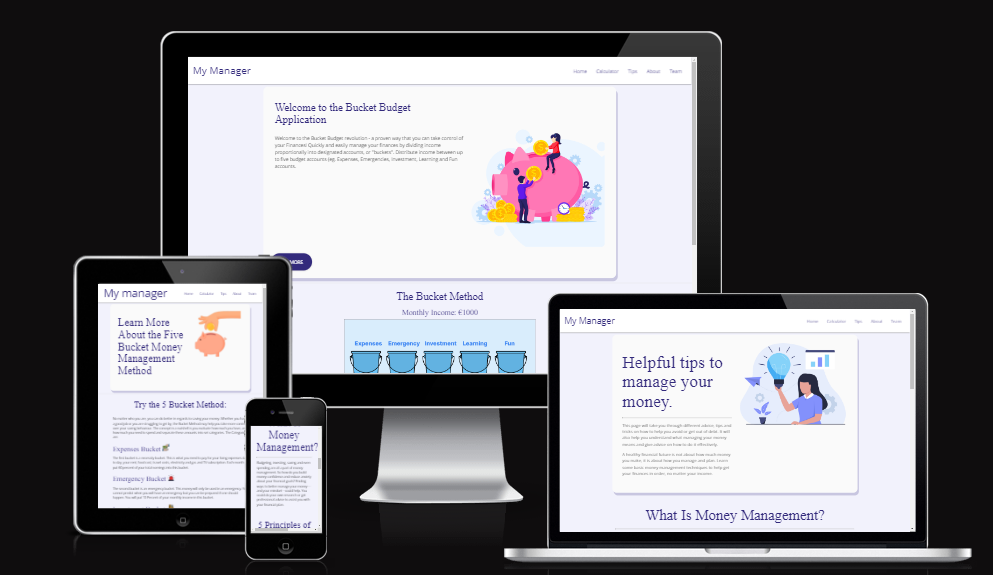

---

## Table of contents

- [\[Project name\](deployed link)](#project-namedeployed-link)
  - [Table of contents](#table-of-contents)
  - [UX](#ux)
    - [User Stories](#user-stories)
    - [Wireframes](#wireframes)
    - [Database schema](#database-schema)
    - [Style and colours](#style-and-colours)
    - [Imagery](#Imagery)
  - [Features](#features)
    - [Existing Features](#existing-features)
    - [Future Features](#future-features)
  - [Technologies Used](#technologies-used)
  - [Testing](#testing)
    - [Found bugs](#found-bugs)
  - [Deployment](#deployment)
  - [Credits](#credits)
    - [Content](#content)
    - [Acknowledgements](#acknowledgements)
  - [\*Disclaimer:](#disclaimer)

---

## UX

---

### User Stories
#### Primary Goals:
- To be able to use the site on different screen sizes (responsiveness).
- To see an easy to read breakdown of my spending (chart.JS)
- To use an accessible site that accounts for all users (colour-blindness, screen readers).

#### Secondary Goals:
- I want to be able to customise the label names on the charts.
- I want to see a comparison of my spending / saving compared to the recommendations (5 bucket principal).

#### Tertiary Goals:
- I want to be able to save the charts to view later (download as PDF).
- I want to be able to use this site in a range of countries (currency converter API)
- I want to be able to access guides on saving and spending less.

[Back to top](#Table-of-contents)
---

## Wireframes
### Desktop
#### Main Page  
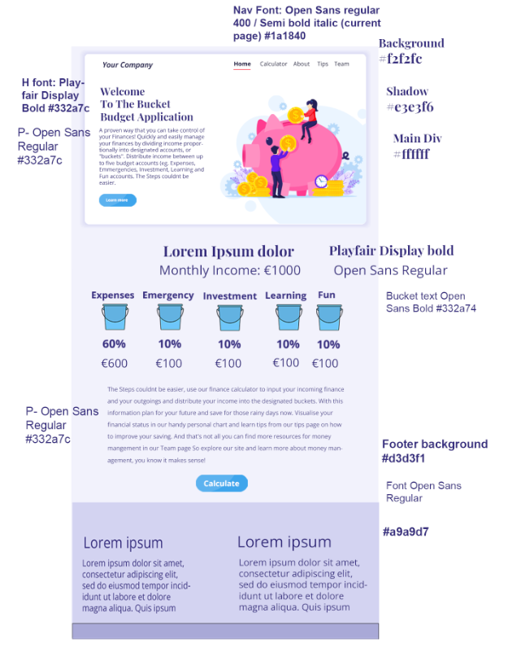  
#### Calculator  
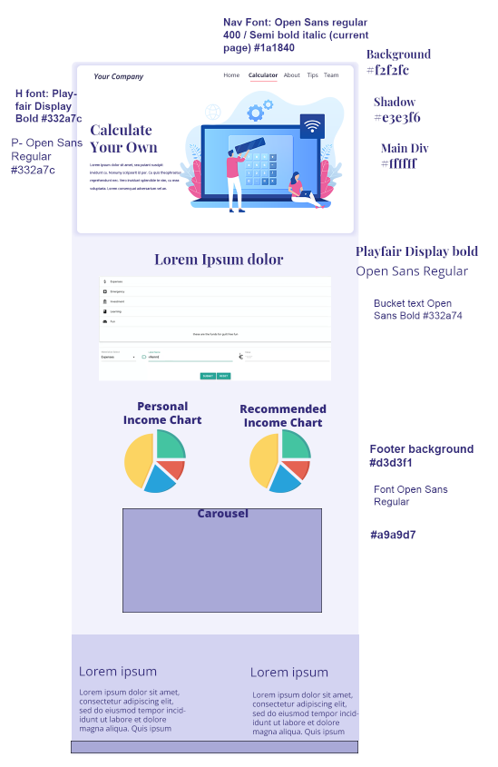  
#### Tips Page  
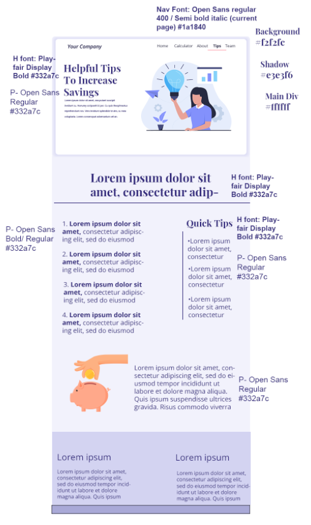  
#### About Page  
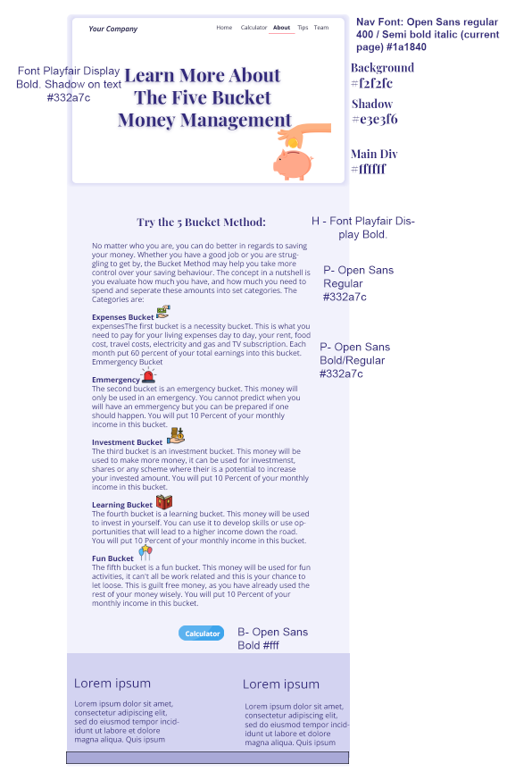  
### Mobile
#### Main Page  
  
#### Calculator  
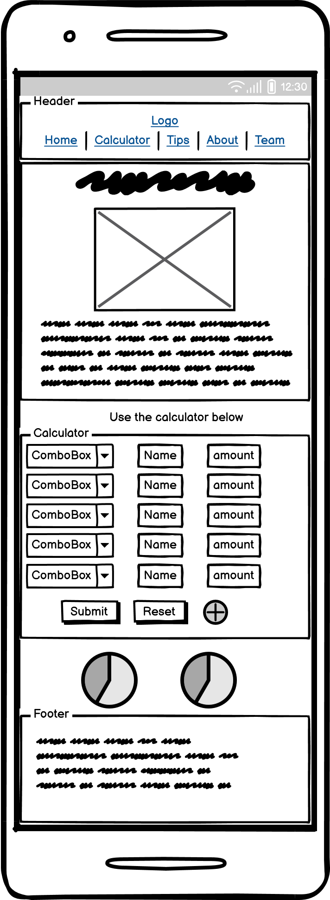  
#### Tips Page  
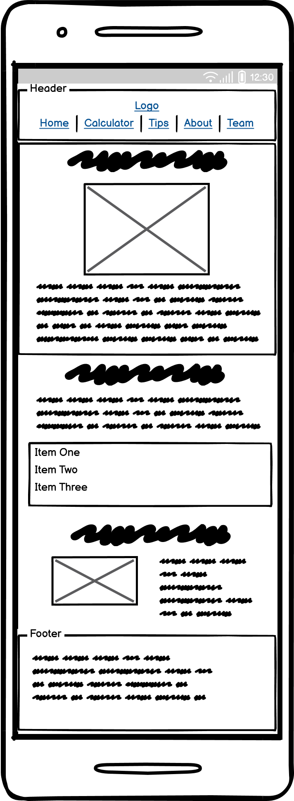  
#### About Page  
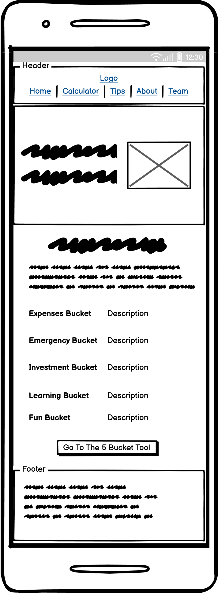  

[Back to top](#Table-of-contents)

---

### Database schema

[Back to top](#Table-of-contents)

---

### Style and colours
#### Color Palette  
The colour palette for this project is based on the purple colour scheme. The purple colour is considered to be a colour of creativity and imagination and complements beautifully the project idea.  
Background colour #f2f2fc Ghost White   
Hero background color #ffffff White
Text colour #332a7c Picotee Blue  
Footer background #d3d3f1 and #a9a9d7 Light Periwinkle and Blue Bell   
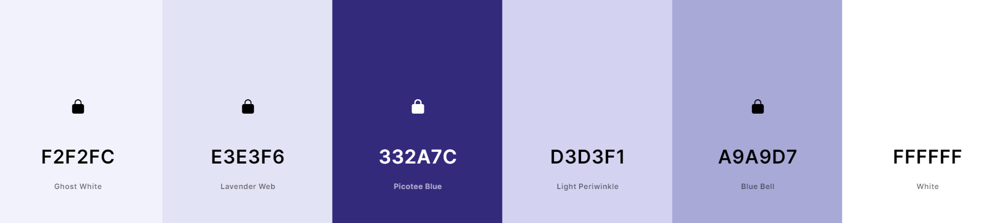  
#### Typography
The fonts used are [Open Sans](https://fonts.google.com/specimen/Open+Sans?query=open) and [Playfair Display](https://fonts.google.com/specimen/Playfair+Display?query=playfair) which really complement eachother and give the project professional look. 

### Imagery
[Creative Fabrica](https://www.creativefabrica.com/) The images used are from Creative Fabrica and come with license for commercial use. 

[Back to top](#Table-of-contents)

---

## Features

### Existing Features

- #### Header - The header consist of the name of the project on the left and the navigation links on the right. On mobile devices the navigation turns into hamburger menu and the links to the pages appear sliding from the left. This is to guarantee better user experience on smaller devices.

- #### Hero sections - There is a hero section on the home page, the tips page and the about page. It consist of relevant to the page heading and image. The hero section on the home page has a see more button which will take the user to the about page which will provide the user with more information.
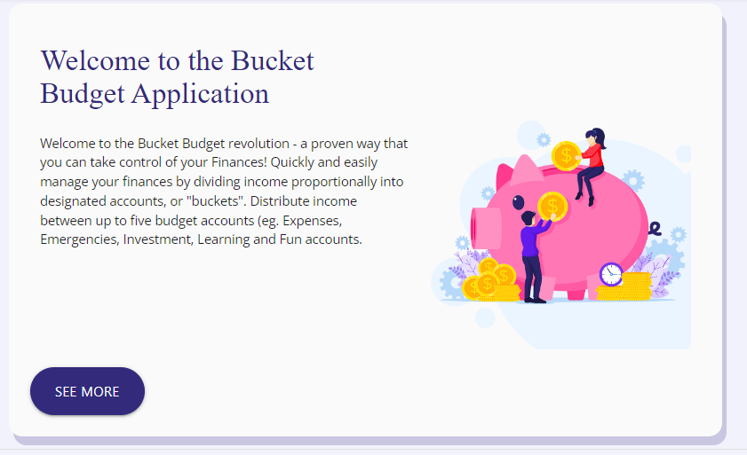

[Back to top](#Table-of-contents)

---
### Home Page
- The home page consist of image which visually represents the main idea behind this project. Presenting the information in a more visual way helps the user the understand the concept easier. This is then followed by section which goes into a bit more detail about the concept followed by a button which when clicked will take the user to the calculator page. 

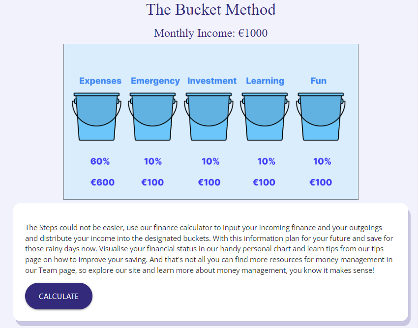

[Back to top](#Table-of-contents)

---
### Calculator Page
- The calculator consist of input fields on the left which have a drop down feature. This allows the user to select the type of bucket/category they would like to add amount to. The middle input field act as a label to the value input which is located on the right. For example the user can select from the drop down input field on the left the category expenses, then add a label rent and type in the amount on the right. This is then followed by the buttons of Submit, Reset or Add.
The Submit button would display the user a graph showing their spendings in categories. The reset button will clear the form. The add button will add another row of input. 

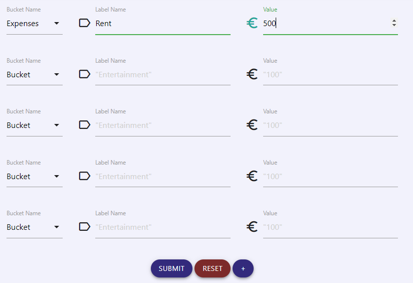

[Back to top](#Table-of-contents)

---
### Tips Page
- The Tips page consist of carefully selected and presented information for the user for better money management. On the left there is a callapsible list with 5 tips followed by image representing saving. On the right there is more information about credit card usage.

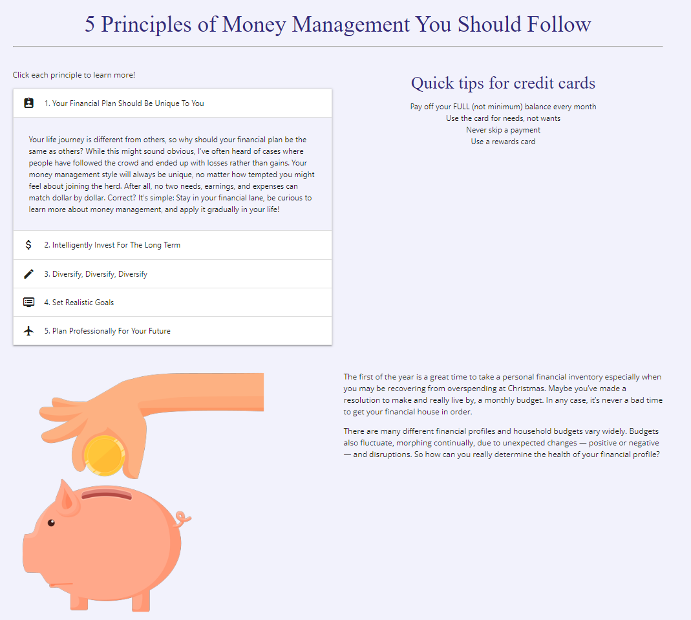

[Back to top](#Table-of-contents)

---
### About Page
- The About page was created to provide more information to the user about the Five Bucket Method. It also has a button which takes the user to the calculator page. 

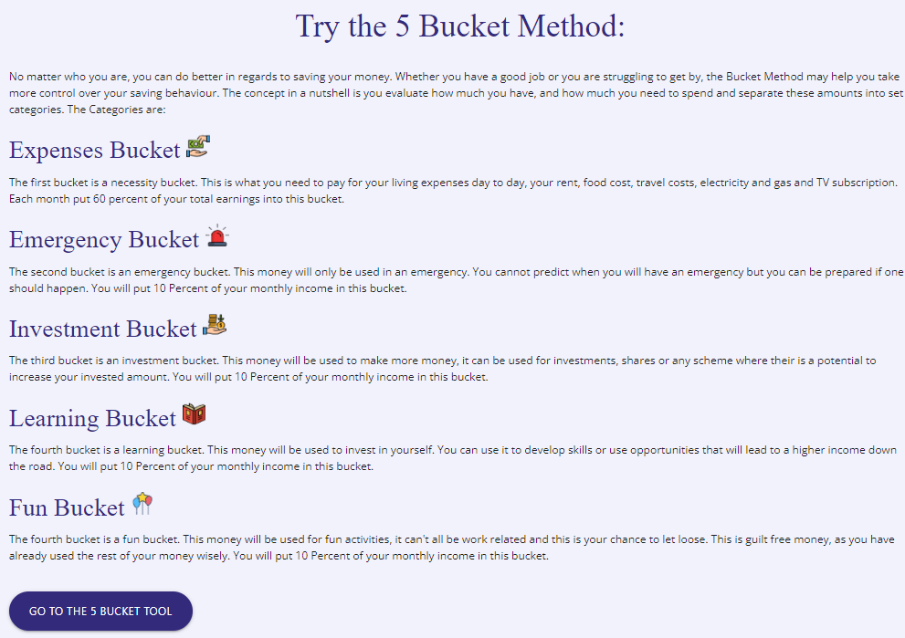

[Back to top](#Table-of-contents)

---
### Team Page
- The Team page consist of information about the team who created the project and links to each member's LinkedIn and GitHub.

[Back to top](#Table-of-contents)

---
### Future Features

- #### Favorite Feature 1

[Back to top](#Table-of-contents)

---

- #### Favorite Feature 2

[Back to top](#Table-of-contents)

---

- #### List of other future features

  - ff1
  - ff2
  - ff3

[Back to top](#Table-of-contents)

---

## Technologies Used

- [GitHub](https://github.com/) - GithHub is the hosting site used to store the source code for the Website and Git Pages is used for the deployment of the live site.
- [Git](https://git-scm.com/) was used as version control software to commit and push code to the GitHub repository where the source code is stored.
- [Google Chrome Developer Tools](https://developer.chrome.com/docs/devtools/) was used as a testing tool during the development of the application. 
- [Google Fonts](https://fonts.google.com/) was used to import the fonts [Open Sans](https://fonts.google.com/specimen/Open+Sans?query=open) and [Playfair Display](https://fonts.google.com/specimen/Playfair+Display?query=playfair)
- [Font Awesome](https://fontawesome.com/) was used for icons.
- [Balsamiq Wireframes](https://balsamiq.com/wireframes/) was used to create the wireframes for the mobile version of the application.
- [Photoshop](https://www.adobe.com/ie/products/photoshop.html) was used to create the desktop mockups and resize and export the images for web. 
- [Coolors.co](https://coolors.co/) was used to display the colour palette
- [Favicon.io](https://favicon.io/) was used to create the favicon for the website.

## Languages
- HTML - used to build the main structure of the website.
- [Materialize Framework](https://materializecss.com/) - used throughout the website for layout and styling.
- CSS - custom written CSS was used as an addition to Materialize. 
- JavaScript - was used to create functionality for the calculator.
- [Jquery](https://jquery.com/)

[Back to top](#Table-of-contents)

---

## Testing

Testing was done...

### Found bugs

- #### bug1

- #### bug2

- #### bug3

---

## Deployment

[Back to top](#Table-of-contents)

---

## Credits
- [CSS Tricks](https://css-tricks.com/css-link-hover-effects/) was used for inspiration for the hover effect on the nav.

### Content

### Acknowledgements
- The Hackathon Team - Big thank you for making Hackathon happen. It was great experience. 

[Back to top](#Table-of-contents)

---

## *Disclaimer: This Project was created for January's Hackathon. It should not be taken as actual financial advice.