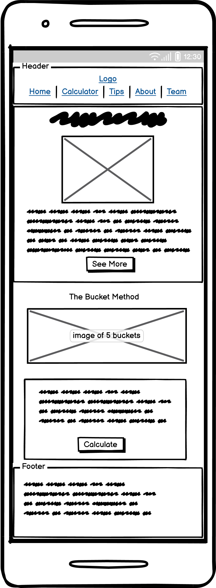

# [5 Bucket Calculator](https://mariamar95.github.io/jan-hackathon/)

The [Bucket Calculator](https://mariamar95.github.io/jan-hackathon/) App is based on Dan Lok’s 5 [Bucket Money Management Concept]( https://medium.datadriveninvestor.com/how-to-manage-money-5b490e9d3d63). 

His concept was designed to teach the user the habit of managing money as a long term solution. This is done by breaking the salary into 5 different buckets; Expenses, Emergency, Investment, Learning and Fun. The suggestion is to commit 60% of our salary to the Expenses bucket and 10% in each of the others. However, these percentages can be adjusted to suit bigger and smaller salaries.

[Deployed App](https://mariamar95.github.io/jan-hackathon/)

Whilst sharing ideas and starting to brainstorm, we tried to take into consideration the skills and strengths of each team member and work on a project where everyone can get involved. We decided to build a front-end app which meant the majority of the team could contribute.

Using Dan Lok’s concept we built a calculator where the user could find out how much money would go in each bucket based on their salary.

We decided to the it a bit further and create a "Buckets Breakdown" calculator where the user can have a better tracking of their expenses. Once the user fills the form a chart will appear and the user can compare how their salary is distributed in the 5 buckets compared to Dan Lok's concept. 

---

## Table of contents

- [5 Bucket Calculator](#5-bucket-calculator)
  - [Table of contents](#table-of-contents)
  - [UX](#ux)
    - [User Stories](#user-stories)
      - [Primary Goals:](#primary-goals)
      - [Secondary Goals:](#secondary-goals)
      - [Tertiary Goals:](#tertiary-goals)
  - [Back to top](#back-to-top)
  - [Wireframes](#wireframes)
    - [Desktop](#desktop)
      - [Main Page ](#main-page-)
      - [Calculator ](#calculator-)
      - [Tips Page ](#tips-page-)
      - [About Page ](#about-page-)
    - [Mobile](#mobile)
      - [Main Page ](#main-page--1)
      - [Calculator ](#calculator--1)
      - [Tips Page ](#tips-page--1)
      - [About Page ](#about-page--1)
    - [Style and colours](#style-and-colours)
      - [Color Palette ](#color-palette-)
      - [Typography](#typography)
    - [Imagery](#imagery)
  - [Features](#features)
    - [Existing Features](#existing-features)
    - [Home Page](#home-page)
    - [Calculator Page](#calculator-page)
    - [Tips Page](#tips-page)
    - [About Page](#about-page)
    - [Team Page](#team-page)
    - [Future Features](#future-features)
  - [Technologies Used](#technologies-used)
  - [Languages](#languages)
  - [Testing](#testing)
    - [Found bugs](#found-bugs)
  - [Deployment](#deployment)
    - [**GitHub Pages**](#github-pages)
    - [**How to deploy GitHub Pages**](#how-to-deploy-github-pages)
    - [**Cloning the repository**](#cloning-the-repository)
  - [Credits](#credits)
    - [Content](#content)
    - [Acknowledgements](#acknowledgements)
  - [\*Disclaimer: This Project was created for January's Hackathon. It should not be taken as actual financial advice.](#disclaimer-this-project-was-created-for-januarys-hackathon-it-should-not-be-taken-as-actual-financial-advice)

---

## UX

---

### User Stories
#### Primary Goals:
- To be able to use the site on different screen sizes (responsiveness).
- To see an easy to read breakdown of my spending (chart.JS)
- To use an accessible site that accounts for all users (colour-blindness, screen readers).

#### Secondary Goals:
- I want to be able to customize the label names on the charts.
- I want to see a comparison of my spending / saving compared to the recommendations (5 Bucket Principle).

#### Tertiary Goals:
- I want to be able to save the charts to view later (download as PDF).
- I want to be able to use this site in a range of countries (currency converter API)
- I want to be able to access guides on saving and spending less.

[Back to top](#Table-of-contents)
---

## Wireframes
### Desktop
#### Main Page  
  
#### Calculator  
  
#### Tips Page  
  
#### About Page  
  
### Mobile
#### Main Page  
  
#### Calculator  
  
#### Tips Page  
  
#### About Page  
  

[Back to top](#Table-of-contents)

---

### Style and colours
#### Color Palette  
The colour palette for this project is based on the purple colour scheme. The purple colour is considered to be a colour of creativity and imagination and complements beautifully the project idea.  
Background colour #f2f2fc Ghost White   
Hero background color #ffffff White
Text colour #332a7c Picotee Blue  
Footer background #d3d3f1 and #a9a9d7 Light Periwinkle and Blue Bell   
  
#### Typography
The fonts used are [Open Sans](https://fonts.google.com/specimen/Open+Sans?query=open) and [Playfair Display](https://fonts.google.com/specimen/Playfair+Display?query=playfair) which really complement eachother and give the project professional look. 

### Imagery
[Creative Fabrica](https://www.creativefabrica.com/) The images used are from Creative Fabrica and come with license for commercial use. 

[Back to top](#Table-of-contents)

---

## Features

### Existing Features

- #### Header - The header consist of the name of the project on the left and the navigation links on the right. On mobile devices the navigation turns into hamburger menu and the links to the pages appear sliding from the left. This is to guarantee better user experience on smaller devices.

- #### Hero sections - There is a hero section on the home page, the tips page and the about page. It consist of relevant to the page heading and image. The hero section on the home page has a see more button which will take the user to the about page which will provide the user with more information.

[Back to top](#Table-of-contents)

---
### Home Page
- The home page consist of image which visually represents the main idea behind this project. Presenting the information in a more visual way helps the user the understand the concept easier. This is then followed by section which goes into a bit more detail about the concept followed by a button which when clicked will take the user to the calculator page. 

[Back to top](#Table-of-contents)

---
### Calculator Page
- The calculator page has 3 sections:
  1. The 5 Bucket Calculator
      
      Users can enter their salary and click calculate to find out how much money has to go in each bucket based on Dan Lok's theory
  2. The Buckets Breakdown 
     
     Users can enter all their regular payments to track how their money is spend. Once they click calculate they will be presented with a chart of their own buckets compared to Lok's theory.
     
  3. The Currency Convertor
     

[Back to top](#Table-of-contents)

---
### Tips Page
- The Tips page consist of carefully selected and presented information for the user for better money management. On the left there is a collapsible list with 5 tips followed by image representing saving. On the right there is more information about credit card usage.

[Back to top](#Table-of-contents)

---
### About Page
- The About page was created to provide more information to the user about the Five Bucket Method. It also has a button which takes the user to the calculator page. 

[Back to top](#Table-of-contents)

---
### Team Page
- The Team page consist of information about the team who created the project and links to each member's LinkedIn and GitHub.

[Back to top](#Table-of-contents)

---
### Future Features

- #### Favorite Feature 1

[Back to top](#Table-of-contents)

---

- #### Favorite Feature 2

[Back to top](#Table-of-contents)

---

- #### List of other future features

  - ff1
  - ff2
  - ff3

[Back to top](#Table-of-contents)

---

## Technologies Used

- [GitHub](https://github.com/) - GithHub is the hosting site used to store the source code for the Website and Git Pages is used for the deployment of the live site.
- [Git](https://git-scm.com/) was used as version control software to commit and push code to the GitHub repository where the source code is stored.
- [Google Chrome Developer Tools](https://developer.chrome.com/docs/devtools/) was used as a testing tool during the development of the application. 
- [Google Fonts](https://fonts.google.com/) was used to import the fonts [Open Sans](https://fonts.google.com/specimen/Open+Sans?query=open) and [Playfair Display](https://fonts.google.com/specimen/Playfair+Display?query=playfair)
- [Font Awesome](https://fontawesome.com/) was used for icons.
- [Balsamiq Wireframes](https://balsamiq.com/wireframes/) was used to create the wireframes for the mobile version of the application.
- [Photoshop](https://www.adobe.com/ie/products/photoshop.html) was used to create the desktop mockups and resize and export the images for web. 
- [Coolors.co](https://coolors.co/) was used to display the colour palette
- [Favicon.io](https://favicon.io/) was used to create the favicon for the website.
- [Exchangerates API](https://exchangeratesapi.io/)was used for the currency converter

## Languages
- HTML - used to build the main structure of the website.
- CSS - custom written CSS was used as an addition to Materialize. 
- [Materialize Framework](https://materializecss.com/) - used throughout the website for layout and styling.
- JavaScript - was used to create functionality for the calculator.
- [Jquery](https://jquery.com/)

[Back to top](#Table-of-contents)

---

## Testing

Testing was done...

### Found bugs

- #### bug1

- #### bug2

- #### bug3

---

## Deployment
### **GitHub Pages**
The website is deployed using GitHub pages. It automatically updates new commits as they are pushed to the repository.

### **How to deploy GitHub Pages**
1. Login to my GitHub account
2. Open the repository
3. Click on Settings
4. Scroll down and click on the Pages tab located on the left of the screen
5. Under 'Source' select the main branch
6. Wait for the page to refresh
7. Scroll down to and locate the website link under the 'GitHub Pages' section

### **Cloning the repository**
1. Open the repository
2. Click the Code button above the list of files
3. Click on GitHub CLI and click on the 'copy' button to copy the URL link
4. Open GitPod 
5. Type 'git clone' and paste the URL link

Find more [here](https://docs.github.com/en/repositories/creating-and-managing-repositories/cloning-a-repository#cloning-a-repository-to-github-desktop)

[Back to top](#Table-of-contents)

---

## Credits
- [CSS Tricks](https://css-tricks.com/css-link-hover-effects/) was used for inspiration for the hover effect on the nav.
- [CodeVille](https://www.youtube.com/watch?v=C-qi-z8phTM&ab_channel=CodesVille) Currency Converter
- FavIcon
    - [Source](https://www.clipartmax.com/download/m2H7i8A0m2G6G6H7_money-flat-icon-ecoverauthority-logo-homepage/ )
    - [Processed at 'favicon-converter'](https://favicon.io/favicon-converter/)

### Content

### Acknowledgements
- The Hackathon Team - Big thank you for making Hackathon happen. It was great experience. 

[Back to top](#Table-of-contents)

---

## *Disclaimer: This Project was created for January's Hackathon. It should not be taken as actual financial advice.