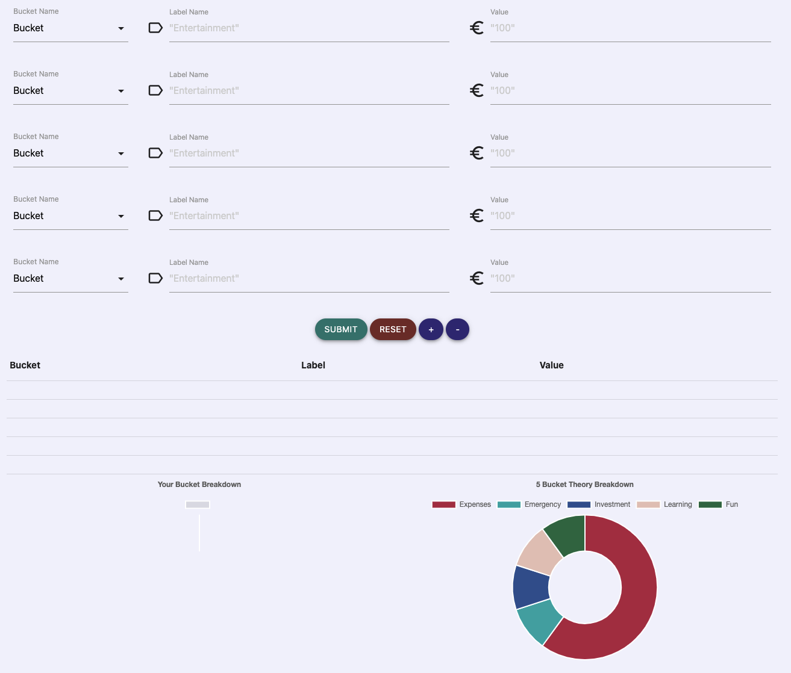

# Bucket Calculator Testing

[View the live project here.](https://mariamar95.github.io/jan-hackathon/)

[View the project README here.](README.md)

## Contents
* [Automated Testing](#automated-testing)
    * [W3C Validator](#w3c-validator)
    * [Lighthouse](#lighthouse)
    * [WAVE](#wave)
* [Manual Testing](#manual-testing)
    * [User Stories Testing](#user-stories-testing)
    * [Full Testing](#full-testing)
* [Bugs](#bugs)
    * [Known Bugs](#known-bugs)
    * [Full Bugs](#solved-bugs)

## Automated Testing:
### W3C Validator

### Lighthouse

#### Desktop Results:

#### Mobile Results:

### WAVE

## Manual Testing:
### User Stories Testing

### Full Testing

## Bugs:
### Known Bugs
#### Create Table - Bucket Name 'undefined'
- **Description:** When adding the new user input rows, the bucket name is not retrieved and instead shows 'undefined'.
- **Cause:** Unkown, possibly the elements of the newly created rows do not follow the same format as the original, or it is due to the Materialize CSS component not being initialized.

Click for Image: Calculate Page - Bucket Name 'undefined'

****

#### Create Chart - Blank Values
- **Description:** When pressing 'Submit' with some inputs not added, the chart and table will display with missing values
- **Cause:** The input is not validated to check if all of the inputs are included, the function should show an error if a input is blank when 'Submit' is pressed.

Click for Image: Calculate Page - Blank values bug

### Solved Bugs
#### Add Row - Input Bug
- **Description:** Pressing the '+' button would cause only the bucket name to be shown.
- **Cause:** This was caused by the incorrect div being selected by the JavaScript DOM manipulation code.
- **Solution:** This was fixed by adding the calculator description outside of the form seletion div.

Click for Image: Calculate Page - Add row input bug

***

#### Add Row - Duplication Bug
- **Description:** Pressing the '+' button would cause the newly created row to copy the values of the first row.
- **Cause:** This was due to the newly created rows being the clone of the first row.
- **Solution:** This was fixed by clearing the inputs of the newly cloned row inputs, before displaying to the user.

Click for Image: Calculate Page - Row duplicate bug

***

#### Reset Button Bug
- **Description:** Pressing the 'Reset' button would not reset the user input rows.
- **Cause:** The cuase was that the inputs used to be part of a form, however this was removed to allow the submitted data to be used by a JavaScript function to display data on the same page. The reset button worked using in-built form reset mechanism.
- **Solution:** A new function was created that cleared the values and classes of the user input rows, when the reset button was clicked.
